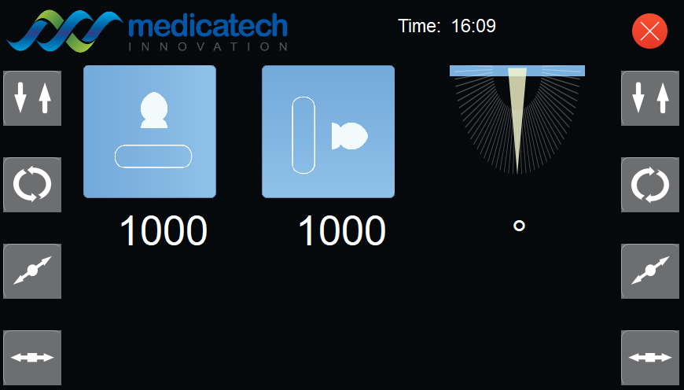

# Digital Radiography System
Raspberry Pi Python application for a control panel 
 
 # Control Panel:

 # Set new i2c bus (bus 3) on pi for ADC and accelerometer:
cd /boot
sudo nano config.txt
dtoverlay=i2c-gpio,bus=3,i2c_gpio_delay_us=1,i2c_gpio_sda=4,i2c_gpio_scl=5

# GUI

# Raspberry Pi GPIO Pinout

